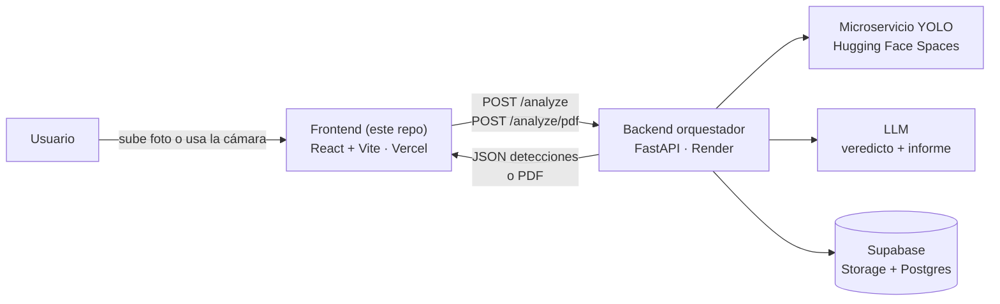

# 🛣️ RoadGuardian AI — Frontend

> Sube una foto de una carretera. En segundos, recibe las incidencias detectadas, un veredicto de prioridad y un informe técnico listo para descargar en PDF.


---

## Tabla de contenidos

- [¿Qué es RoadGuardian?](#qué-es-roadguardian)
- [Arquitectura general](#arquitectura-general)
- [Funcionalidades de este frontend](#funcionalidades-de-este-frontend)
- [El backend, en contexto](#el-backend-en-contexto)
- [Qué queda por integrar en el frontend](#qué-queda-por-integrar-en-el-frontend)
- [Stack tecnológico](#stack-tecnológico)
- [Estructura del proyecto](#estructura-del-proyecto)
- [Puesta en marcha](#puesta-en-marcha)
- [Variables de entorno](#variables-de-entorno)
- [Despliegue](#despliegue)
- [Problemas comunes](#problemas-comunes)
- [Convenciones de contribución](#convenciones-de-contribución)

---

## ¿Qué es RoadGuardian?

RoadGuardian AI es una herramienta de **inspección automática del pavimento**. Un modelo de visión por computador (YOLO) localiza daños sobre la foto de una carretera, y un LLM redacta un veredicto de prioridad y un informe técnico en lenguaje natural a partir de esas detecciones.

Este repositorio contiene **solo el frontend**: la interfaz en React que sube la imagen, pinta las detecciones sobre la foto y da acceso al informe, tanto en pantalla como en PDF.

## Arquitectura general



El frontend nunca habla con Supabase ni con el modelo directamente: todo pasa por la API del backend.

## Funcionalidades de este frontend

### 📷 Subida de imagen (drag & drop, selector de archivo o cámara en vivo)

[`ImageUploader`](src/components/ImageUploader.jsx) acepta arrastrar y soltar una foto, seleccionarla desde el explorador de archivos, o capturarla con la cámara en directo mediante [`CameraCapture`](src/components/CameraCapture.jsx) (usa `getUserMedia`, funciona tanto con la webcam del PC como con la cámara trasera del móvil).

### 🔍 Página "Analizar" (`/`)

Sube la imagen, llama una única vez a `POST /analyze` y muestra en pantalla ([`AnalizarPage.jsx`](src/pages/AnalizarPage.jsx)):

- La foto con las cajas de detección superpuestas ([`DetectionCanvas`](src/components/DetectionCanvas.jsx)).
- Una tabla con cada daño, su confianza y el % de superficie afectada ([`ResultsTable`](src/components/ResultsTable.jsx)).
- Un badge de prioridad (`alta` / `media` / `baja`) con la acción recomendada ([`PriorityBadge`](src/components/PriorityBadge.jsx)).
- El informe técnico redactado por el LLM, renderizado con un parser ligero propio de markdown (cabeceras, negritas/cursivas y listas) en vez de texto plano con `##` y `**` literales ([`InformeTecnico`](src/components/InformeTecnico.jsx)).

Las clases de daño que el modelo distingue hoy (ver [`DetectionCanvas.jsx`](src/components/DetectionCanvas.jsx#L3-L8)) son:

| Clase | Descripción |
|---|---|
| `pothole` | Bache |
| `longitudinal_crack` | Grieta longitudinal |
| `transverse_crack` | Grieta transversal |
| `alligator_crack` | Grieta en piel de cocodrilo |

### 📄 Página "Generar informe PDF" (`/informe-pdf`)

Sube la imagen y llama directamente a `POST /analyze/pdf` ([`InformePdfPage.jsx`](src/pages/InformePdfPage.jsx)): el informe se descarga automáticamente en cuanto el backend responde, sin pasar antes por la vista de resultados en pantalla.

`/analyze` y `/analyze/pdf` son **rutas independientes a propósito**: el usuario elige su intención (ver resultados o directamente descargar el informe) antes de subir la foto, así cada endpoint se llama una única vez en vez de encadenar las dos llamadas automáticamente.

### 🎨 Diseño visual

Tema oscuro de "consola de inspección" (paleta asfalto/ámbar definida en [`tailwind.config.js`](tailwind.config.js)), con un hero con una carretera dibujada en CSS y una cuadrícula que ilustra los tipos de daño detectados ([`Hero`](src/components/Hero.jsx), [`DetectGrid`](src/components/DetectGrid.jsx)).

## El backend, en contexto

El backend vive en otro repositorio, pero documentamos aquí sus piezas más recientes porque **el frontend tendrá que reflejarlas** más adelante (ver siguiente sección).

### 4. Persistencia en Supabase

Mientras el usuario recibe el resultado, el backend guarda automáticamente toda la información en Supabase:

| Dónde | Qué se guarda |
|---|---|
| Storage | Imagen original |
| Tabla `inspections` | Fecha · nombre del archivo · nivel de alerta · acción recomendada · número de detecciones · estado · referencia a la imagen |
| Tabla `detections` | Cada detección por separado: tipo de daño · confianza · bounding box · relación con la inspección mediante `inspection_id` |

Gracias a esto, cada inspección queda registrada y puede recuperarse posteriormente.

> **Nota:** `api/services/supabase_service.py` ya tiene definidas —pero sin implementar, con `pass`— las funciones `get_inspections`, `get_inspection` y `delete_inspection`. Están así a propósito, preparadas para integrarlas cuando exista el historial en el frontend.

### 5. Generación del PDF

Cuando el usuario pide el informe en PDF, el backend vuelve a realizar el análisis completo y genera el archivo listo para descargar (`reports/pdf.py`). Por ahora, ese PDF **no se guarda todavía** en Supabase: se genera y se devuelve en la misma petición, sin persistir.

## Qué queda por integrar en el frontend

El proyecto funciona de principio a fin, pero varias piezas que ya existen (o están previstas) en el backend todavía no tienen su correspondiente pieza en esta interfaz:

| Backend | Estado en el backend | Qué falta aquí, en el frontend |
|---|---|---|
| **Imagen anotada** | Se tienen los bounding boxes, pero aún no se dibujan sobre una copia de la imagen para guardarla | Cuando el backend la sirva, mostrarla (p. ej. en el historial) en vez de recalcular las cajas en el canvas cada vez |
| **PDF persistente** | Hoy solo se genera y se devuelve; la idea es guardarlo en el bucket `reports` | Añadir un botón de "descargar" que traiga el PDF ya guardado (por URL o por `inspection_id`), sin volver a generarlo |
| **Evitar el doble análisis** | Ahora mismo, si el usuario pulsa las dos opciones, el backend ejecuta YOLO y el LLM dos veces. La idea es analizar una sola vez y servir el PDF bajo demanda a partir de lo ya guardado | Las dos páginas (`/` y `/informe-pdf`) evitan que un mismo clic dispare las dos llamadas, pero si el backend cambia a "analizar una vez, servir el PDF por id", el frontend deberá adaptar `InformePdfPage` para pedir el informe ya generado en vez de volver a subir la imagen |
| **Historial de inspecciones** | Toda la información ya se guarda en Supabase (`inspections` + `detections`) | Es la pieza grande pendiente: una **página nueva de Historial** — ver detalle de este punto abajo |

### Historial de inspecciones (la pieza pendiente más grande)

Como ya se guarda toda la información en Supabase, el paso natural es una página nueva en este frontend (p. ej. `/historial`) donde el usuario pueda:

- [ ] Consultar inspecciones anteriores (listado con fecha, nivel de alerta, nº de detecciones).
- [ ] Ver la imagen original y, cuando exista, la imagen anotada.
- [ ] Descargar el PDF asociado a una inspección.
- [ ] Revisar el detalle de cada detección (tipo de daño, confianza, bounding box).
- [ ] Filtrar por fecha o nivel de alerta.
- [ ] Eliminar una inspección.

Esto consumirá los endpoints `get_inspections`, `get_inspection` y `delete_inspection` del backend en cuanto se implementen.

## Stack tecnológico

| Categoría | Tecnología |
|---|---|
| Librería UI | React 19 |
| Bundler / dev server | Vite 8 |
| Enrutado | React Router 7 |
| Estilos | Tailwind CSS 3.4 (tema propio: `asphalt`, `concrete`, `amber`) |
| Linter | oxlint |
| Despliegue | Vercel (frontend) + Render (backend) |

## Estructura del proyecto

```text
src/
├── components/
│   ├── CameraCapture.jsx     # Modal de cámara en vivo (getUserMedia)
│   ├── DetectGrid.jsx        # Cuadrícula ilustrativa de tipos de daño
│   ├── DetectionCanvas.jsx   # Imagen + cajas de detección superpuestas
│   ├── Hero.jsx              # Cabecera visual (carretera en CSS)
│   ├── ImageUploader.jsx     # Zona de subida (drag&drop / archivo / cámara)
│   ├── InformeTecnico.jsx    # Render ligero del informe del LLM
│   ├── Layout.jsx            # Cabecera + navegación entre páginas
│   ├── PriorityBadge.jsx     # Badge de nivel de alerta
│   └── ResultsTable.jsx      # Tabla de detecciones
├── pages/
│   ├── AnalizarPage.jsx      # "/" — analiza y muestra resultados en pantalla
│   └── InformePdfPage.jsx    # "/informe-pdf" — analiza y descarga el PDF
├── services/
│   └── api.js                # Llamadas a /analyze y /analyze/pdf
├── mocks/
│   └── mockAnalysis.js       # Fixture de ejemplo para desarrollo sin backend
└── App.jsx                   # Definición de rutas (react-router-dom)
```

## Puesta en marcha

```bash
# 1. Clonar e instalar dependencias
git clone https://github.com/Bootcamp-IA-P6/RoadGuardian-Frontend.git
cd RoadGuardian-Frontend
npm install

# 2. Configurar las variables de entorno (ver siguiente sección)
cp .env.example .env

# 3. Arrancar en modo desarrollo
npm run dev
```

Scripts disponibles:

| Comando | Qué hace |
|---|---|
| `npm run dev` | Arranca el servidor de desarrollo de Vite |
| `npm run build` | Genera el build de producción en `dist/` |
| `npm run preview` | Sirve el build de producción localmente |
| `npm run lint` | Ejecuta oxlint sobre el proyecto |

## Variables de entorno

| Variable | Descripción | Ejemplo |
|---|---|---|
| `VITE_API_URL` | URL base del backend | `http://127.0.0.1:8000` (local) o la URL de Render en producción |

Si no se define, `src/services/api.js` usa como valor por defecto el backend ya desplegado en Render.

## 🌐 Despliegue

| Servicio | Plataforma | Enlace |
|---|---|---|
| 🖥️ Frontend | Vercel | [road-guardian-frontend.vercel.app](https://road-guardian-frontend.vercel.app) |
| 🧠 Backend — Orquestador | Render | [roadguardian-backend-wahv.onrender.com](https://roadguardian-backend-wahv.onrender.com) |
| 🎯 Microservicio YOLO | Hugging Face Spaces | [huggingface.co/spaces/Gemita284/roadguardian-api](https://huggingface.co/spaces/Gemita284/roadguardian-api) |

El frontend se despliega en **Vercel**. Al ser una SPA con rutas de cliente (`/`, `/informe-pdf`), [`vercel.json`](vercel.json) redirige cualquier ruta a `index.html` para que React Router pueda resolverla:

```json
{ "rewrites": [{ "source": "/(.*)", "destination": "/index.html" }] }
```

## Problemas comunes

**Error de CORS al analizar una imagen** (`No 'Access-Control-Allow-Origin' header...`): el backend solo permite un conjunto concreto de orígenes. En desarrollo local, asegúrate de acceder desde la URL exacta que el backend tiene en su lista blanca (por ejemplo, `http://localhost:5173`) — otro puerto, `127.0.0.1` en vez de `localhost`, o un dominio distinto serán rechazados aunque el backend esté funcionando correctamente.

## Convenciones de contribución

- Commits en formato convencional (`feat:`, `fix:`, `chore:`...).
- Una rama por funcionalidad, con Pull Request hacia `develop`.

## Equipo

|  | Nombre | Rol |
|---|---|---|
| 🧭 | Gema Yébenes | Scrum Master · Desarrollo |
| 🎯 | Camila Arenas | Product Owner · Desarrollo |
| 👤 | Joaquín Lázaro | Team Member |
| 👤 | Maryori Cruz | Team Member |
